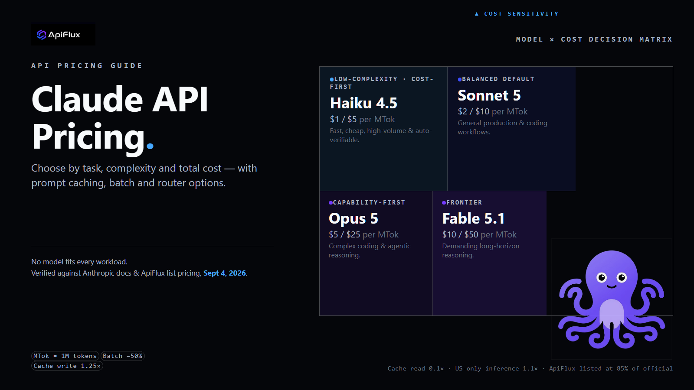
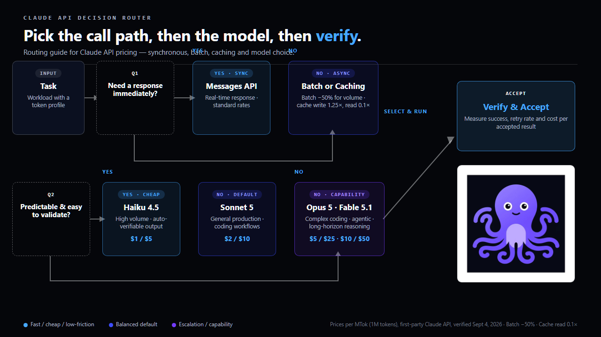
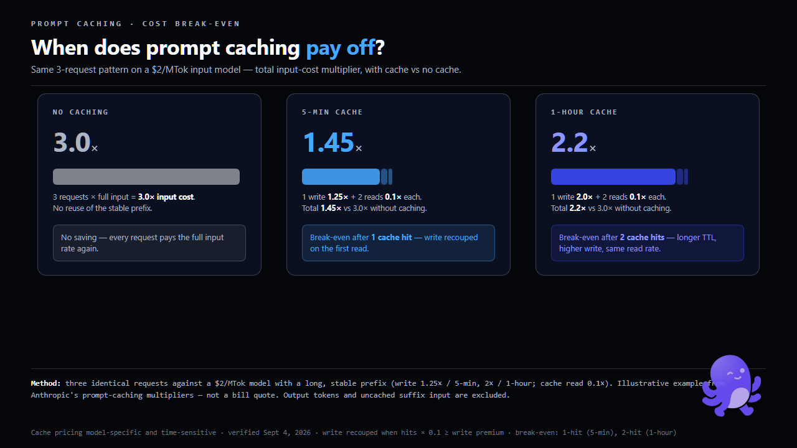
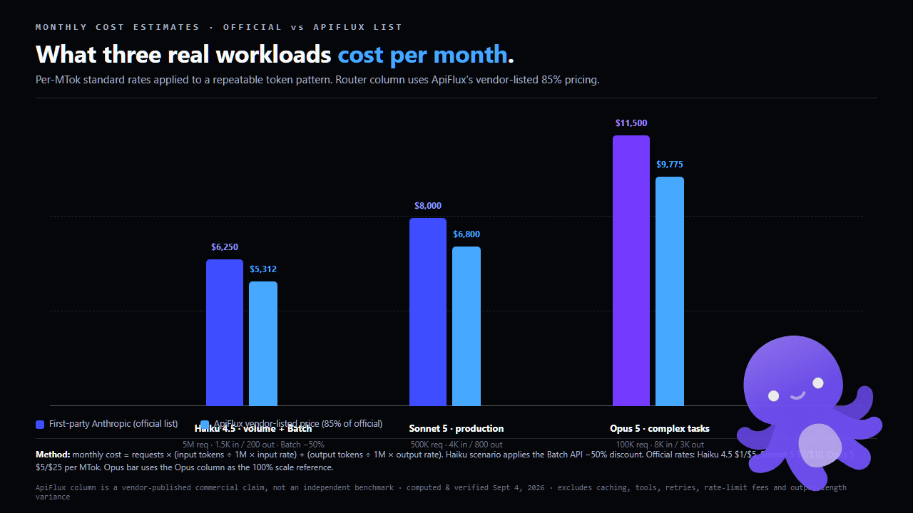

# Claude API Pricing (2026): Token Rates, Caching & Batch Discounts



As of **September 4, 2026**, Anthropic's first-party Claude API is quoted in USD per **MTok** (one million tokens), and standard input rates range from **$1 per million input tokens and $5 per million output tokens for Claude Haiku 4.5** up to **$10 per million input tokens and $50 per million output tokens for Claude Fable 5.1**. Batch processing cuts standard token prices by 50% for asynchronous workloads, and prompt caching has separate write and read pricing. For teams routing through a gateway, ApiFlux advertises Claude Sonnet 5 at **$1.70 input / $8.50 output per MTok** — 85% of Anthropic's list price — though that is a vendor-published claim, not an independently audited rate. Prices are time-sensitive; recheck Anthropic's live pricing before committing to a budget.

> **At a glance**
>
> - Claude API pricing is usage-based, not a fixed monthly subscription.
> - Input and output tokens have separate rates; output is more expensive.
> - Haiku 4.5 has the lowest listed standard rate ($1 / $5 per MTok).
> - Sonnet 5 is a general-purpose candidate; its $2 / $10 rate is now standard pricing.
> - The Batch API cuts standard token prices by 50% for asynchronous work.
> - Prompt caching only helps when stable prefixes are reused within the cache TTL.
> - ApiFlux advertises 85% of list price (e.g., Sonnet 5 at $1.70 / $8.50) and a $1 starting credit; these are vendor-published claims.

## Quick answer: how much does the Claude API cost?

For Anthropic's first-party Claude API, the current standard model rates are:

| Model | Input per MTok | Output per MTok | Best treated as |
|---|---:|---:|---|
| Claude Fable 5.1 | $10 | $50 | Demanding reasoning and long-horizon agentic work, subject to availability |
| Claude Opus 5 | $5 | $25 | Complex coding, agents, and enterprise workloads |
| Claude Sonnet 5 | $2 | $10 | General-purpose speed and capability balance (now standard pricing) |
| Claude Haiku 4.5 | $1 | $5 | Fast, lower-cost tasks and high-volume workloads |

*Source: [Anthropic pricing documentation](https://platform.claude.com/docs/en/about-claude/pricing), checked September 4, 2026.*

**Official vs ApiFlux — listed price comparison** (ApiFlux figures are vendor-published, checked September 4, 2026):

| Model | Anthropic first-party (in / out) | ApiFlux listed (in / out) | Listed difference |
|---|---:|---:|---:|
| Claude Fable 5 | $10 / $50 | $8.50 / $42.50 | −15% |
| Claude Opus 5 | $5 / $25 | $4.25 / $21.25 | −15% |
| Claude Sonnet 5 | $2 / $10 | $1.70 / $8.50 | −15% |
| Claude Haiku 4.5 | $1 / $5 | $0.85 / $4.25 | −15% |

*Source: Anthropic first-party rates from official pricing docs; ApiFlux listed rates from [apiflux.ai/models/anthropic](https://apiflux.ai/models/anthropic), checked September 4, 2026. ApiFlux figures are vendor-published claims, not independent benchmarks.*

**Quick decision — what should you start with?**

| If you need… | Start by evaluating… | Main trade-off |
|---|---|---|
| The lowest listed token price | Haiku 4.5 | May require more validation |
| A general production balance | Sonnet 5 | Test against your own task set |
| Complex coding or long-horizon agents | Opus 5 | Higher token rate |
| Demanding reasoning at any cost | Fable 5.1 | Higher price and availability risk |
| Offline bulk processing | Batch API | No real-time response |
| One key, unified balance, multi-channel routing, and logs | A gateway such as ApiFlux | Additional dependency to verify |

Anthropic's model overview positions Fable 5.1 for demanding reasoning, Opus 5 for complex agentic coding and enterprise work, Sonnet 5 for a speed–intelligence balance, and Haiku 4.5 for the lowest latency and price. Those are **vendor positioning statements**, not independent benchmark results. For a production decision, test representative prompts with your own data.

The prices above cover standard first-party token usage. Your actual cost can also include:

- Input tokens, including relevant tool definitions and tool results.
- Output tokens generated by the model.
- Prompt-cache writes and cache reads.
- Batch API pricing when requests are processed asynchronously.
- Server-side tool fees, such as web search.
- Optional service modifiers, such as US-only inference (`inference_geo: "us"`, a 1.1× multiplier) or fast mode.
- Different pricing, billing units, availability, and lifecycle policies on Amazon Bedrock, Google Cloud, Microsoft Foundry, or other platforms.

## Claude API pricing calculator

Anthropic lists Sonnet 5 at $2 per million input tokens and $10 per million output tokens in its [current pricing documentation](https://platform.claude.com/docs/en/about-claude/pricing). The basic token-cost formula is:

```text
base input cost  = monthly requests × average input tokens  ÷ 1,000,000 × input rate
base output cost = monthly requests × average output tokens ÷ 1,000,000 × output rate
retry-adjusted cost = base cost × (1 + retry rate)
accepted-result cost = total cost ÷ accepted production results
```

To estimate a workload without doing the math by hand, use our **interactive [Claude API cost calculator](claude-api-cost-calculator.html)**. It accepts monthly requests, average input and output tokens, model, Batch and prompt-caching toggles, retry rate, tool calls, and an ApiFlux routing switch, and returns monthly input/output cost, cache write and read cost, a batch estimate, direct Anthropic cost, the ApiFlux vendor-listed estimate, and cost per accepted result.

A short worked example with Claude Sonnet 5, using the rates above (one request with 20,000 input tokens and 4,000 output tokens):

```text
input:  20,000 ÷ 1,000,000 × $2  = $0.04
output:  4,000 ÷ 1,000,000 × $10 = $0.04
estimated request cost                 = $0.08
```

This is a simple estimate for the model tokens shown. It does not include cache operations, server-side tool charges, taxes, negotiated commercial terms, failed-request handling, or platform-specific billing differences. For a side-by-side coding-model comparison that informs model choice, see our [best LLMs for coding 2026](https://apiflux.ai/blog/best-llm-for-coding) guide.

## How Claude API billing works

### Input and output tokens are not priced equally

Output tokens are more expensive than input tokens across the current model lineup. An application that generates unnecessarily long answers can cost much more than one that sends a large but stable context and requests a concise response.

Before reducing model quality to lower the bill, check whether you can:

1. Set an appropriate maximum output length.
2. Ask for structured, concise responses.
3. Remove irrelevant context from each request.
4. Reuse stable instructions with prompt caching.
5. Route simple, predictable tasks to a lower-cost model.
6. Measure retries and human review, not only raw token usage.

### Tools, retries, and failed loops count too

A Claude API request with tools is not priced only on the visible user question. Token usage can include tool definitions and tool results that become part of the model context, plus an automatic tool-use system prompt. Anthropic's pricing documentation currently lists web search at **$10 per 1,000 searches**, plus standard token costs for search-generated content. Web fetch has **no additional charge** beyond the standard token costs for content that enters the conversation context. Newer server tools (code execution, text editor, computer use, browser use) add their own input-token overheads or, in some cases, execution-time billing.

When estimating a tool-using application, record at least: user and system input tokens, tool-definition tokens, tool-result tokens, search or other server-tool calls, output tokens, retries and failed tool loops, cache writes and reads, and human review or downstream processing. A model that appears inexpensive in a chat-only test can have a very different cost profile once it is connected to search, code execution, retrieval, or a multi-step agent loop.

## Current Claude API model prices

The following table summarizes the principal current models listed in Anthropic's [model overview](https://platform.claude.com/docs/en/models/overview) and [pricing documentation](https://platform.claude.com/docs/en/about-claude/pricing). Prices are **first-party Claude API base rates**, checked on September 4, 2026.

| Model | API ID | Input / output per MTok | Context window | Maximum output |
|---|---|---:|---:|---:|
| Claude Fable 5.1 | `claude-fable-5-1` | $10 / $50 | 1M tokens | 128K tokens |
| Claude Opus 5 | `claude-opus-5` | $5 / $25 | 1M tokens | 128K tokens |
| Claude Opus 4.8 | `claude-opus-4-8` | $5 / $25 | 200K tokens | 64K tokens |
| Claude Opus 4.7 | `claude-opus-4-7` | $5 / $25 | 200K tokens | 64K tokens |
| Claude Sonnet 5 | `claude-sonnet-5` | $2 / $10 | 1M tokens | 128K tokens |
| Claude Sonnet 4.6 | `claude-sonnet-4-6` | $3 / $15 | 200K tokens | 64K tokens |
| Claude Haiku 4.5 | `claude-haiku-4-5-20251001` | $1 / $5 | 200K tokens | 64K tokens |

*Source: [Anthropic pricing](https://platform.claude.com/docs/en/about-claude/pricing) and [models overview](https://platform.claude.com/docs/en/models/overview), checked September 4, 2026.*

Opus 4.8 and Opus 4.7 share the same $5 / $25 rate as Opus 5 but use the previous tokenizer and smaller context windows. Sonnet 4.6 is priced at $3 / $15 — 50% more than Sonnet 5's standard $2 / $10 — so migrating from 4.6 to Sonnet 5 lowers token cost while increasing context. Anthropic's pricing page also lists Opus 4.6, Opus 4.5, and Sonnet 4.5 at the same rates as their immediate successors; check the live table before relying on any older model ID.

Model IDs and availability can differ by platform. Anthropic uses a dateless model-ID format for the 4.6 generation and later (for example, `claude-opus-5`), and each ID is a pinned snapshot, not an evergreen pointer — see the [model IDs and versioning documentation](https://platform.claude.com/docs/en/about-claude/models/model-ids-and-versions). Older model versions can appear in pricing or lifecycle documentation for reference even when they are retired. Do not copy a model ID from an old article without checking the current [Models API](https://platform.claude.com/docs/en/models/overview) and lifecycle documentation.

For reproducible applications, record the exact model ID, prompt version, tool configuration, date, and evaluation results. A model alias or a partner-cloud deployment name may not behave like the first-party Claude API identifier.

## Which Claude model should you choose?



**Decision tree:**

```text
Do you need a response immediately?
├── Yes → Use the synchronous Messages API
└── No
    ├── Large volume → Evaluate the Batch API
    └── Repeated long context → Evaluate Prompt Caching

Is the task predictable and easy to validate?
├── Yes → Start with Haiku 4.5
└── No
    ├── General production work → Evaluate Sonnet 5
    └── Complex coding / reasoning → Benchmark Opus 5 or Fable 5.1
```

**Scenario-to-model decision table:**

| Scenario | Start with | Measure before committing | Not a fit when |
|---|---|---|---|
| High-volume classification, extraction, routing, short transforms | Haiku 4.5 | Success rate, output length, retry rate, latency, review burden | Deep multi-step reasoning; cheap responses fail validation and need repeated retries |
| General assistants, coding workflows, structured generation | Sonnet 5 | First-pass success, tool reliability, output length, cost per accepted result | Strict validation fails; long-horizon reasoning demands a higher-capability model |
| Complex agentic coding, enterprise workloads, deep reasoning | Opus 5 | Successful outcomes, retry burden, review effort on a fixed task set | Simple high-volume tasks where Haiku or Sonnet pass on the first attempt |
| Demanding reasoning, long-horizon agents where cheaper models fail | Fable 5.1 | Task-level success on workloads where cheaper models fail; availability | Routine workloads; price-sensitive; guaranteed availability is required |

### Claude Haiku 4.5

**Price:** $1 input / $5 output per MTok.

**Good fit:** Classification, extraction, routing, short transformations, and other high-volume workloads where the output can be checked automatically.

**Poor fit:** Workloads that require deep multi-step reasoning or where a cheap response fails validation and must be retried repeatedly.

**What to measure:** Correct classification or extraction rate, average output length, retry rate, latency at your required traffic level, human review burden, and total cost per accepted result. A cheap response that requires repeated retries or manual correction may be more expensive than a higher-priced response that passes validation on the first attempt.

### Claude Sonnet 5

**Price:** $2 input / $10 output per MTok, now standard pricing.

**Good fit:** General assistant features, coding workflows, structured generation, and moderate-complexity agent tasks.

**Poor fit:** Workloads where the model fails strict validation or requires long multi-step reasoning that demands a higher-capability model.

**What to measure:** First-pass success, retry rate, latency, output length, and cost per accepted result, especially when the application needs tool calls, long context, strict JSON, multilingual output, or reliable edge-case handling. For a fuller comparison of coding-oriented LLM options, see our [best LLMs for coding 2026](https://apiflux.ai/blog/best-llm-for-coding) guide on the ApiFlux blog.

### Claude Opus 5

**Price:** $5 input / $25 output per MTok.

**Good fit:** Complex code changes, deeper reasoning, agentic coding, and enterprise workloads where fewer failed attempts can justify the higher token rate.

**Poor fit:** Simple, high-volume, easily validated tasks where Haiku or Sonnet pass on the first attempt.

**What to measure:** Successful outcomes, retry burden, latency, and review effort on a fixed task set. Do not convert Anthropic's positioning into a blanket claim that Opus 5 is the most cost-effective model for every project.

### Claude Fable 5.1

**Price:** $10 input / $50 output per MTok.

**Good fit:** Demanding reasoning and long-horizon agentic work where lower-cost models fall short in evaluation.

**Poor fit:** Most routine workloads — its price is substantially higher than Sonnet 5 or Haiku 4.5.

**What to measure:** Task-level success on the specific workloads where cheaper models fail, plus availability and access. Limited-availability or changing-preview products should not be treated as universally accessible production dependencies.

## Prompt caching costs

Prompt caching reduces the cost of repeatedly sending the same prompt prefix, such as a large system instruction, reference document, tool definition set, or conversation history. It is most useful when the stable content is large and reused within the cache time-to-live. Anthropic's [prompt caching documentation](https://platform.claude.com/docs/en/build-with-claude/prompt-caching) lists these standard cache multipliers relative to the model's base input price:

| Cache operation | Pricing multiplier | TTL or meaning |
|---|---:|---|
| 5-minute cache write | 1.25× base input | Cache is valid for 5 minutes |
| 1-hour cache write | 2× base input | Cache is valid for 1 hour |
| Cache read (hit) | 0.1× base input | Applies to a cache hit |

*Source: [Anthropic prompt caching documentation](https://platform.claude.com/docs/en/build-with-claude/prompt-caching), checked September 4, 2026.*

Anthropic's current pricing table lists Claude Fable 5.1 cache hits and refreshes at **$0.25 per MTok, or 0.025× its $10 base input rate**. Because cache pricing is model-specific and time-sensitive, recheck the model-specific table before publication.

At the standard multipliers, a 5-minute cache write pays off after **one** successful cache read (1.25× write vs. a second full 1× input), and a 1-hour cache write pays off after **two** successful reads (2× write vs. three 1× inputs). For example, on a model with a $2 per MTok input rate, sending the same eligible prefix three times without caching costs three base input charges; a 1-hour cache costs 2× for the initial write plus 0.1× for each of two reads, or 2.2× in total.

> **Note on stacking:** Batch, caching, and data-residency modifiers can interact, but these modifiers do not make the total bill automatically predictable. Calculate each token category separately and confirm the selected model and platform's billing rules.



This break-even analysis assumes the prefix is long enough to be cacheable, the content before the breakpoint is unchanged, the follow-up request arrives within the TTL, and a cache hit actually occurs. Output tokens and uncached suffix tokens are excluded from this narrow comparison.

### How to design a cache-friendly prompt

Put stable material before variable material:

```text
stable system instructions
stable tools and schemas
stable reference documents
cache breakpoint
variable user question
```

Changing content before the breakpoint can invalidate the cached segment. A cache strategy should therefore be tested with the same request shape used in production, not only with a small demonstration prompt.

## Batch API pricing

Anthropic's [Message Batches API](https://platform.claude.com/docs/en/build-with-claude/batch-processing) is designed for large volumes of requests that do not need an immediate response. The official documentation says it provides a **50% discount versus standard API pricing** and processes requests asynchronously.

| Model | Standard input / output per MTok | Batch input / output |
|---|---:|---:|
| Claude Fable 5.1 | $10 / $50 | $5 / $25 |
| Claude Opus 5 | $5 / $25 | $2.50 / $12.50 |
| Claude Sonnet 5 | $2 / $10 | $1 / $5 |
| Claude Haiku 4.5 | $1 / $5 | $0.50 / $2.50 |

*Source: [Anthropic Message Batches documentation](https://platform.claude.com/docs/en/build-with-claude/batch-processing), checked September 4, 2026.*

**Synchronous vs asynchronous — which do you need?**

| | Synchronous Messages API | Message Batches API |
|---|---|---|
| Latency | Real-time response | Most batches finish in under an hour |
| Price | Standard rates | 50% off standard rates |
| Good fit | User is waiting for an answer | Evaluations, offline analysis, bulk classification, scheduled jobs |
| Limits | Model rate limits | 100,000 requests or 256 MB per batch; must complete within 24 hours |
| Result handling | Inline response | JSONL file, results downloadable for 29 days |

Treat the batch figures as calculated examples based on the published 50% discount, not a universal quote for every platform or billing arrangement. Prompt caching and other pricing modifiers interact with batch pricing.

The Batch API also has operational constraints. Requests are processed independently, results are **not guaranteed to preserve input order**, and streaming, fast mode, and `max_tokens: 0` are not supported. Use unique `custom_id` values and build a result-matching strategy around those IDs. For a gateway that supports both synchronous and asynchronous Claude workloads across multiple channels, see the [ApiFlux setup guide](https://apiflux.ai/docs/setup).

## Claude API pricing vs Claude subscription pricing

The Claude **API** is pay-as-you-go: you are billed for the tokens and features your application uses. It is not a prepaid bundle of a consumer or team subscription, and a subscription should not be treated as prepaid API credits.

| Option | Billing model | Best for |
|---|---|---|
| Claude API | Per-MTok token usage + feature fees | Applications, services, automation, integrations |
| Claude Pro | Monthly subscription with usage limits | Individual users |
| Claude Max | Higher-tier subscription with higher limits | High-frequency individual users |
| Team / Enterprise | Team subscriptions with seats | Organizations |
| Claude Code + Console | Depends on Console/API billing path | Development teams |

Separate Claude consumer or team plans (for example, the chat/desktop subscription tiers) buy product access, not API capacity. If you are building an application, plan for API token costs, spend limits, and rate limits separately from any Claude subscription you hold.

## Claude API vs Bedrock and Vertex AI

The prices in this article refer to the **first-party Claude API** unless a section says otherwise. They should not automatically be applied to Amazon Bedrock, Google Cloud Vertex AI, Microsoft Foundry, Claude Platform on AWS, resellers, gateways, or other API providers.

| Platform | Billing | Notes |
|---|---|---|
| Claude API (first-party) | Per-MTok token rates | Prices and multipliers in this article |
| Amazon Bedrock | Provider-invoiced; regional/global endpoints | Regional endpoints include a 10% premium over global endpoints |
| Google Cloud Vertex AI | Provider-invoiced; regional/global/multi-region endpoints | Regional endpoints include a 10% premium over global endpoints |
| Claude Platform on AWS | Claude Consumption Units (CCUs) via AWS Marketplace | Token usage converted to CCUs at $0.01 per CCU |

Partner platforms can use different billing units, regional pricing, model IDs, availability rules, and retirement schedules. If you are comparing providers, normalize the comparison first:

1. Use the same model generation and model behavior where possible.
2. Confirm whether prices are for input, output, cache, and tools separately.
3. Check whether taxes, cloud fees, or regional multipliers apply.
4. Verify the exact model ID and availability.
5. Compare a fixed workload with identical success criteria. A gateway such as ApiFlux can abstract these platform differences behind one key and one balance — browse the [full model catalog](https://apiflux.ai/models) to see which channels each model supports.

## How ApiFlux can reduce operational complexity

> **Commercial disclosure:** ApiFlux is mentioned because it operates the publishing project. The pricing, feature, and discount statements in this section are **vendor-published claims**, not independent benchmark results. Verify them before making procurement decisions.

**The problem.** A team using multiple model providers may need to manage several API keys, balances, model IDs, rate limits, and usage dashboards. That operational overhead is separate from Anthropic's published token rates. When a single provider experiences an outage or rate-limit throttle, an application that depends on one endpoint can fail until the provider recovers.

**What ApiFlux advertises.** ApiFlux's public site presents it as an AI router and gateway that gives you one API key for 100+ frontier models, including Claude, GPT, Gemini, DeepSeek, Qwen, and Kimi. It advertises native Anthropic, OpenAI, and Gemini-compatible endpoints, automatic failover, transparent per-token billing, one shared balance, and usage monitoring. For compatible clients, connecting may require only a base-URL and key change — but confirm the endpoint and model IDs your code uses before assuming no other changes are needed.

**Multi-channel routing.** ApiFlux advertises that Claude requests can be routed across multiple upstream channels — including the Anthropic first-party API, Amazon Bedrock, and Google Cloud Vertex AI — so that if one channel is throttled or unavailable, the gateway can fall through to another. The advertised architecture is:

```text
Your application
    │  one API key, one balance
    ▼
ApiFlux gateway
    ├── Anthropic first-party API  (channel 1)
    ├── Amazon Bedrock             (channel 2)
    └── Google Cloud Vertex AI     (channel 3)
         │
         ▼
    Claude model response
```

This is a vendor-described routing topology. Before relying on it, test failover behavior with your own workload: confirm which channels are actually available for the model IDs you use, how routing decisions are made, whether cache and tool billing are preserved across channels, and whether a fallback changes the model behavior or regional endpoint.

**Vendor claims to treat as unverified.** ApiFlux advertises pricing at **85% of the maker's official list price** (its listed Claude prices, checked September 4, 2026, are shown below) and currently advertises a **$1 starting credit** on signup without a credit card. These are vendor-published commercial claims, not independently audited savings results. ApiFlux describes zero data retention in its public materials. Review the current privacy and retention terms before sending sensitive prompts, and test failover behavior with your own workload before relying on either claim.

| Model | Anthropic first-party (in / out per MTok) | ApiFlux listed price (in / out per MTok) |
|---|---:|---:|
| Claude Fable 5 | $10 / $50 | $8.50 / $42.50 |
| Claude Opus 5 | $5 / $25 | $4.25 / $21.25 |
| Claude Sonnet 5 | $2 / $10 | $1.70 / $8.50 |
| Claude Haiku 4.5 | $1 / $5 | $0.85 / $4.25 |

*Source: Anthropic rates from official pricing docs; ApiFlux listed rates from [apiflux.ai/models/anthropic](https://apiflux.ai/models/anthropic), checked September 4, 2026. Vendor-published claims.*

**Integration example.** For compatible Anthropic SDK clients, switching the base URL to ApiFlux can be as short as:

```python
from anthropic import Anthropic

client = Anthropic(
    api_key="your-apiflux-key",
    base_url="https://api.apiflux.ai",
)

response = client.messages.create(
    model="claude-sonnet-5",
    max_tokens=1024,
    messages=[{"role": "user", "content": "Hello, ApiFlux!"}],
)
```

This is an illustrative example for compatible clients. Verify the exact base URL, model ID format, authentication method, and feature support in the [ApiFlux documentation](https://apiflux.ai/docs/quickstart) before deploying.

**What to verify before production use.** Confirm which Claude model IDs are supported (ApiFlux lists `Claude Fable 5` and `Claude Sonnet 5`), whether the endpoint is compatible with the Anthropic Messages API format, how input/output/cache/tool usage are reported, whether routing changes the model or deployment region, how balances, refunds, failed requests, and rate limits are handled, where request logs are stored and retained, and whether the published discount applies to every feature including cache reads and batch usage.

Where to start:

> **Ready to compare Claude API rates on ApiFlux?**
>
> - [Browse Claude models and live listed prices →](https://apiflux.ai/models/anthropic)
> - [Create your API key (no credit card, $1 starting credit) →](https://apiflux.ai/keys)
> - [Read the quickstart and make your first call →](https://apiflux.ai/docs/quickstart)
> - [See how to run Claude Code through ApiFlux →](https://apiflux.ai/docs/claude-code)

## Monthly cost examples and sensitivity

The illustrative monthly estimates below use the base rates above, before cache and batch effects:

| Workload example | Model | Requests / mo | Avg input / output tokens | Monthly estimate |
|---|---:|---:|---:|---:|
| High-volume classification | Haiku 4.5 | 5,000,000 | 1,500 / 200 | ≈ $12,500 |
| General assistant | Sonnet 5 | 500,000 | 4,000 / 800 | ≈ $8,000 |
| Complex agentic coding | Opus 5 | 100,000 | 20,000 / 4,000 | ≈ $20,000 |

**Worked example — general assistant on Sonnet 5.** Suppose an application serves 500,000 requests per month. Each request sends 4,000 input tokens (system prompt + conversation history + user question) and receives 800 output tokens.

```text
Monthly input tokens:  500,000 × 4,000 = 2,000,000,000  = 2,000 MTok
Monthly output tokens: 500,000 ×   800 =   400,000,000  =   400 MTok

Input cost:  2,000 MTok × $2  = $4,000
Output cost:   400 MTok × $10 = $4,000
─────────────────────────────────────
Direct Anthropic estimate:        $8,000 / month

ApiFlux listed (85%):             $6,800 / month
Listed difference:                $1,200 / month
```

If 30% of the input is a stable prefix that hits a 5-minute cache (0.1× read rate), the input cost drops:

```text
Cached input:   2,000 MTok × 30% × 0.1× × $2 = $120
Uncached input: 2,000 MTok × 70% ×      $2 = $2,800
Cache write (one per session):                  ≈ $10 (estimate)
Output:                                         $4,000
─────────────────────────────────────────────────────
Cached estimate:                                ≈ $6,930 / month
```

These are illustrative figures for method demonstration only; your real bill depends on caching, tools, retries, batch use, and negotiated terms. Use them to shape the calculation, not as a quote for your workload.



**Sensitivity — what moves the bill most:**

| Variable | Change | Effect on monthly cost |
|---|---|---|
| Output tokens | +50% | Significant increase (output rates are 5× input) |
| Retry rate | 0% → 10% | Adds roughly 10% to token cost |
| Cache hit rate | 0% → 80% | Lowers repeated-input cost substantially |
| Batch usage | 0% → 100% | Cuts standard token charges by 50% |
| Human review | Increases | Can offset API savings |

If you route requests through a gateway such as ApiFlux, its listed per-token rates are 15% below official list prices (for example, Claude Opus 5 at $4.25 / $21.25 instead of $5 / $25), which lowers the token-cost component. Factor in the gateway's own fee, failover behavior, and cache accounting before assuming the saving.

## Claude API pricing FAQ

### Is Claude API pricing monthly or pay-as-you-go?

The first-party Claude API is usage-based. Charges depend on token usage and applicable features rather than a single fixed API subscription price. Separate Claude consumer or team subscriptions should not be treated as prepaid API credits.

### What does MTok mean in Claude API pricing?

MTok means one million tokens. Input and output tokens are priced separately, and the rate depends on the selected model.

### What is the cheapest Claude API model?

In the current first-party lineup, Claude Haiku 4.5 has the lowest listed standard rate at $1 per million input tokens and $5 per million output tokens. Whether it is the cheapest production choice depends on task success, retries, latency, and review cost.

### Why is Claude Sonnet 5 priced at $2 / $10?

Sonnet 5's $2 input / $10 output rate was announced at launch as introductory pricing through August 31, 2026. The scheduled increase to $3 / $15 on September 1, 2026 was canceled, so $2 / $10 is now the standard price, per Anthropic's [pricing documentation](https://platform.claude.com/docs/en/about-claude/pricing).

### Does the Claude API have a free tier?

Anthropic's API documentation does not establish a permanent free API tier in the sources reviewed for this guide. Check the current Claude Console billing documentation for account-specific credits or promotions, and do not assume the consumer Claude plan structure maps to API usage. (Separately, ApiFlux currently advertises a $1 starting credit on its homepage; eligibility and terms may change, so confirm them before signing up.)

### Can prompt caching reduce the total bill?

It can reduce the cost of repeatedly sending an eligible stable prefix when cache hits occur within the selected TTL. It does not automatically reduce output tokens, variable input, tool calls, or every request in an application.

### How much cheaper is the Claude Message Batches API?

Anthropic documents a 50% discount versus standard API pricing for the Message Batches API. Batch requests are asynchronous, so the discount is appropriate for workloads that can wait for processing and retrieval.

### How is Claude Code billed relative to the Claude API?

Claude Code can be used through subscription plans or a Claude Console/API account. When it uses a Claude Console account or API key, usage may be billed according to the applicable API rates. Subscription plans have their own prices, limits, and terms, so do not automatically apply this API pricing table to every Claude Code session. For setup details, see the [ApiFlux Claude Code documentation](https://apiflux.ai/docs/claude-code).

### Does a Claude API gateway change Anthropic's official prices?

A gateway may add its own fees, markup, currency conversion, or operational terms. Confirm the gateway's current pricing and usage accounting separately. ApiFlux is described in this article as a routing and management option, not as proof of lower underlying Anthropic rates.

### Are Claude API prices the same on Bedrock and Vertex AI?

Not necessarily. Cloud marketplaces can have different pricing, billing units, model IDs, regional rules, availability, and lifecycle policies. Compare each platform using its own current official documentation.

## Next steps: estimate, compare, and start

1. **Estimate your monthly bill** with the [interactive Claude API cost calculator](claude-api-cost-calculator.html) — input your request volume, token sizes, cache hit rate, and Batch usage.
2. **Compare listed prices** across every Claude model on the [ApiFlux Claude model page](https://apiflux.ai/models/anthropic), including vendor-listed 85%-of-list rates.
3. **Create an API key** on the [Keys page](https://apiflux.ai/keys) — ApiFlux currently advertises a $1 starting credit with no credit card required.
4. **Follow the quickstart** to make your first call, or read the [setup guide](https://apiflux.ai/docs/setup) and [FAQ](https://apiflux.ai/docs/faq) for configuration details.
5. **Explore related guides:** [best LLMs for coding in 2026](https://apiflux.ai/blog/best-llm-for-coding) and [Qwen3-8 release window prep](https://apiflux.ai/blog/qwen3-8-release-window-prep) on the ApiFlux blog.

## Sources and update history

This article was written as an editorial guide using Anthropic's official documentation, checked on **September 4, 2026**:

- [Anthropic Claude API pricing](https://platform.claude.com/docs/en/about-claude/pricing)
- [Anthropic models overview](https://platform.claude.com/docs/en/models/overview)
- [Anthropic prompt caching](https://platform.claude.com/docs/en/build-with-claude/prompt-caching)
- [Anthropic Message Batches API](https://platform.claude.com/docs/en/build-with-claude/batch-processing)
- [Anthropic API rate limits](https://platform.claude.com/docs/en/api/rate-limits)
- [Anthropic model IDs and versions](https://platform.claude.com/docs/en/about-claude/models/model-ids-and-versions)
- [Anthropic model deprecations](https://platform.claude.com/docs/en/about-claude/model-deprecations)
- [Claude pricing page](https://claude.com/pricing)
- [ApiFlux home](https://apiflux.ai/) — vendor claims: 15%-below-list pricing, $1 starting credit, zero data retention
- [ApiFlux model catalog](https://apiflux.ai/models)
- [ApiFlux Claude model prices](https://apiflux.ai/models/anthropic)
- [ApiFlux quickstart documentation](https://apiflux.ai/docs/quickstart)
- [ApiFlux setup guide](https://apiflux.ai/docs/setup)
- [ApiFlux FAQ](https://apiflux.ai/docs/faq)
- [Best LLMs for coding 2026 — ApiFlux blog](https://apiflux.ai/blog/best-llm-for-coding)
- [Qwen3-8 release window prep — ApiFlux blog](https://apiflux.ai/blog/qwen3-8-release-window-prep)

**Update triggers.** Review immediately when Anthropic changes model rates, model IDs, caching multipliers, Batch API terms, tool prices, spend limits, or lifecycle dates, and when ApiFlux changes its prices, supported models, privacy or retention terms, or page URLs. Check model IDs and lifecycle monthly; review FAQ and structure quarterly.

**Changelog**

- **2026-09-04** — Confirmed Sonnet 5 remains at $2 / $10 (standard pricing). Updated Fable 5.1 cache-hit rate to $0.25 / MTok (0.025×). Removed unverified "new user free credits" wording. Added ApiFlux commercial disclosure, vendor-claim labels, model decision tree, interactive cost calculator, "Claude API vs subscription" and "vs Bedrock/Vertex AI" sections, sensitivity analysis, and in-place source citations. Added Opus 4.8 / 4.7 and Sonnet 4.6 to the model price table. Added official-vs-ApiFlux price comparison to the quick-answer section. Expanded ApiFlux multi-channel routing architecture and Python SDK integration example. Added detailed monthly cost worked example. Added per-table source citations, scenario-to-model decision table, prominent CTA blocks, and expanded internal links to existing ApiFlux docs and blog. Established SOURCES.md source ledger.

---

*By **Jason Zhu**, Builder at ApiFlux AI. I route my own Claude Code and production workloads through multi-provider gateways and write about LLM infrastructure, pricing, and reliability. This article contains vendor-published claims about ApiFlux; all Anthropic pricing is sourced from official documentation and verified on the date above.*

This article does not claim an independent benchmark ranking, guaranteed savings, guaranteed availability, or a guaranteed search ranking. Model recommendations are conditional editorial guidance based on published pricing and vendor-described positioning; validate them against your own workload.
